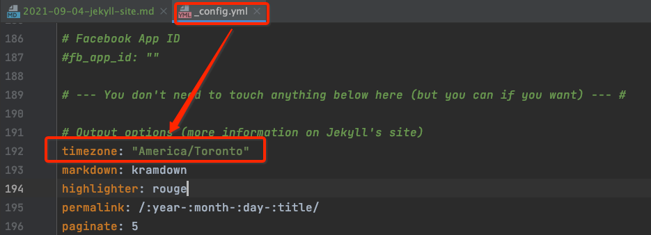

# 前言
终于下定决心，花一些事件，把自己沉淀与思考，都用GitHubPages保存起来。
* 一来，作为自己备忘，如此之多的知识，如果不加以梳理，在脑海里始终就是分散的点。
* 二来，有幸同道中人看到，加以指正与讨论，更是妙哉！

# 常用命令
- 启动本地服务
```shell
bundle exec jekyll serve --draft
```

- 编译，生成_site目录
```shell
bundle exec jekyll build
```

- 在Gemfile中增加了插件之后，安装插件
```shell
bundle install
```

# 踩坑记录
## 时区问题导致文章不可见
### 问题描述
新的博客文章写好了，并且看日志也自动生成了，但：
1. 在_site目录下看不到生成的文件
2. 本地调试也看不到新增的文件
3. 往github上push之后，远程站点打开就可以看到。

相关日志如下，怀疑是由于时间戳的问题。因为Post的时间戳是2021-09-05，且本机当前时间也是2021-09-05，但看如下本地服务器启动的时间戳，应该是UTC+0的时区，
还是在2021-09-04。Jekyll应该有这种潜规则或者限制，<mark><font color=red>大于当前日期的Post默认不显示</font></mark>。

### 解决方案
如下图，修改`_config.yaml`文件中`timezone`配置即可，修改成`Asia/Shanghai`


# 疑问
## 同一天的文章，如何进行先后排序？
---
使用front-matter里的date就可以，date可以具体到时、分、秒。精确到时分秒，会自动按照时分秒排序。


## 如何把博客进行Archive？
***
- 参见： [How to group posts by date on home page in Jekyll?](https://stackoverflow.com/questions/18669143/how-to-group-posts-by-date-on-home-page-in-jekyll)
- 日期格式要修改下，日期格式参见 [Date formatting](https://learn.cloudcannon.com/jekyll/date-formatting/)，按照我个人习惯，修改成：`'%Y-%m-%d'`

## 如何把博客进行一级标题分类？
---


## 如何为anchor增加可点击链接？
---

## 如何自动生成front-matter的date？
---

# 吐槽
* 生成TOC，花太多功夫了，并且即使做出来，也丑出天际，羡慕别人这种浮动的
* 插入图片也不太方便了。
* 中文字体太丑了，大小也不合适，找时间修改下字体。

慢慢来吧，一点点建设起来。