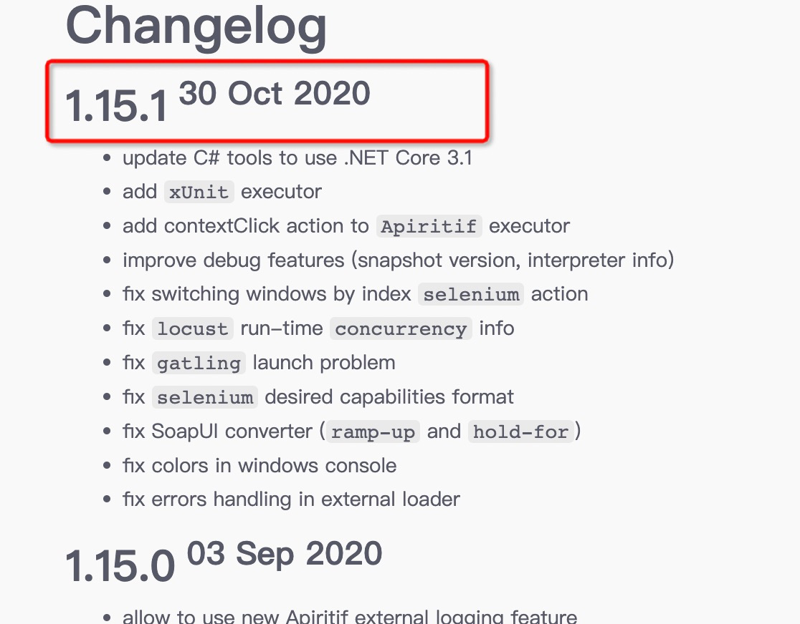
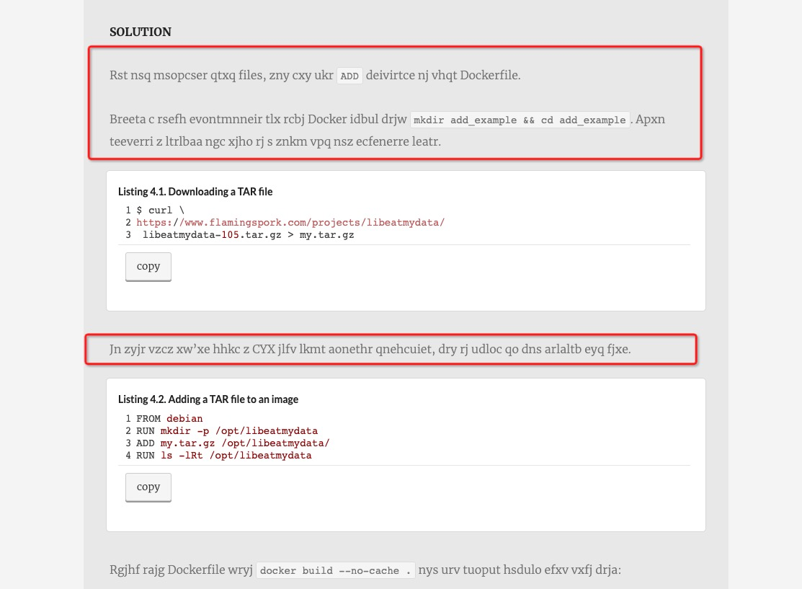
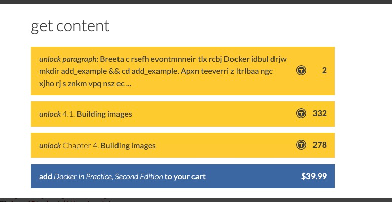
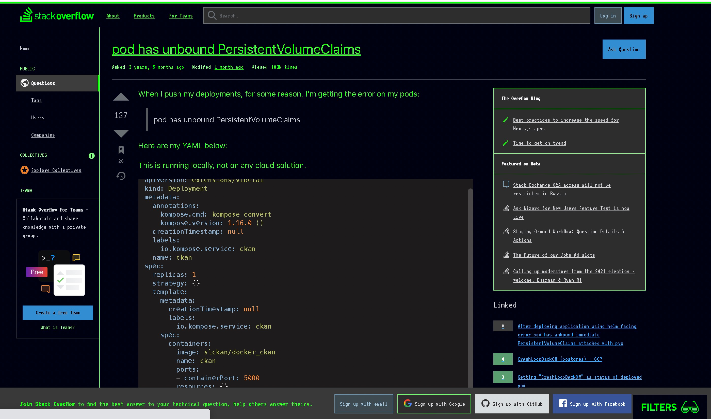

# 前言
代码, 架构, 逻辑, 产品, 设计等, 不应该是枯燥乏味的, 不应该是痛苦复杂的, 而应该是有趣的, 简单的, 应该是geek的, 应该是美的.
这里记录下自己的点滴发现, 希望能走出CRUD与纷杂的业务逻辑, 逐渐提高一点审美与品味.

# changelog优雅的格式
- [taurus](https://gettaurus.org/docs/Changelog2020/#1-15-1sup-30-Oct-2020-sup)

# 引导用户付费阅读
- manning的[docker-in-practice-second-edition](https://livebook.manning.com/book/docker-in-practice-second-edition/chapter-4/13), 不会强制用户点击付费才能看见付费内容, 而是用很巧妙的方法, 对内容进行模糊化
- 可以付出不同的价格, 来解锁 代码区域->小章节->大章节->整本书

# 输入密码
- 输入用户名时, 睁开眼睛

- 输入密码时, 闭上眼睛

# Github不同的页面风格
- 可以选择不同的filter, 虽然没啥卵用, 但感觉非常geek, 很有意思

# RGB颜色的中文名称
猛然发现

