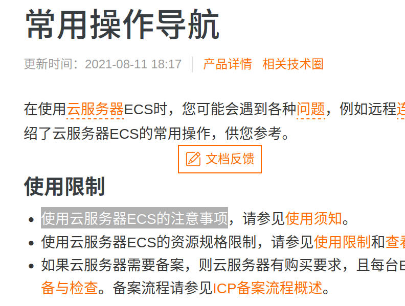
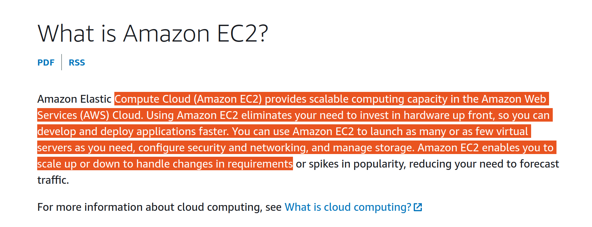
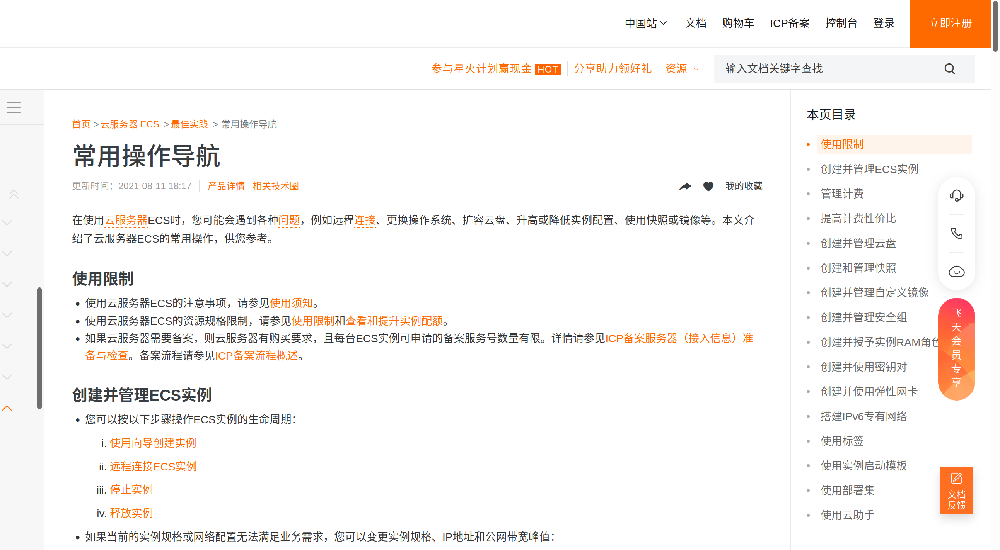
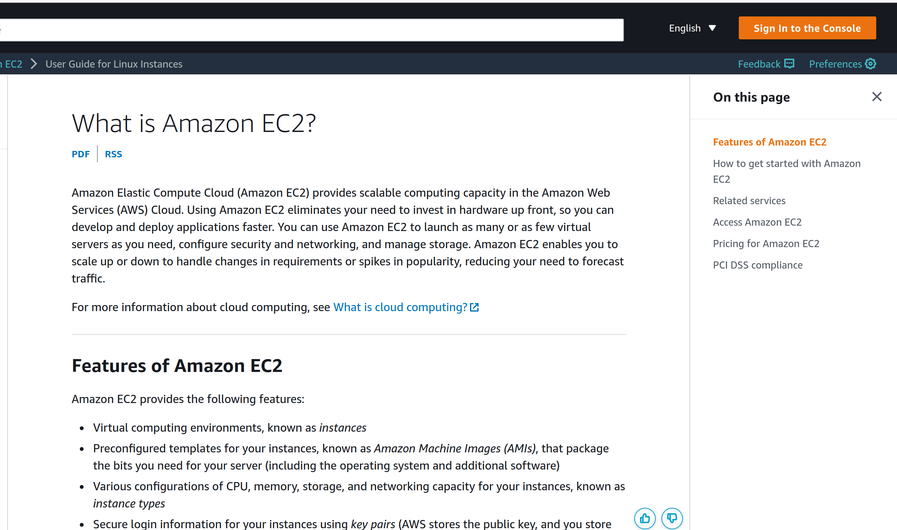

# 前言
记录一些自己明显感觉退步，不适的设计。引以为戒。

# 过多的打扰
## 技术文档选中弹框
- 阿里云官网技术文档，选中文字之后，会自动弹出“文档反馈”说明，本意是好的，希望得到用户的反馈。
- 但在开发者实际阅读过程中，尤其是大段的技术文档，经常会习惯性地鼠标点选，此时弹出弹框，非常分散注意力。
- 反观海外的云厂商，都非常克制甚至朴素。

## 页面过多堆砌
- 阿里云官方技术文档，右上角是一堆营销计划“参与星火赢现金”，“分享助力好礼”；右下角是“销售咨询”，“会员专享”，“文档反馈”。跟牛皮藓一样。
- 反观aws，几乎没有过多打扰。

# 不一的风格

