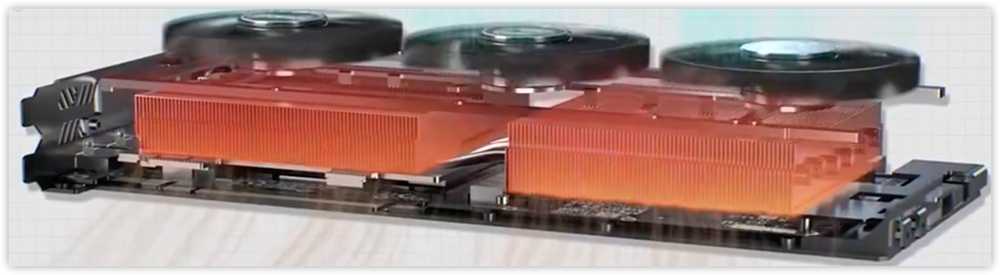
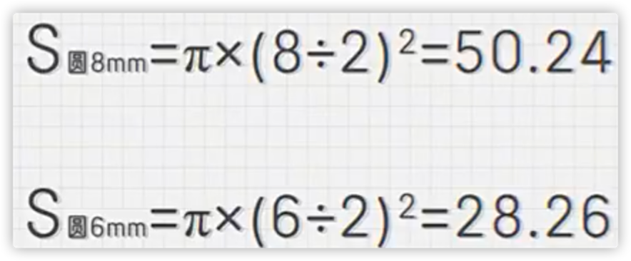
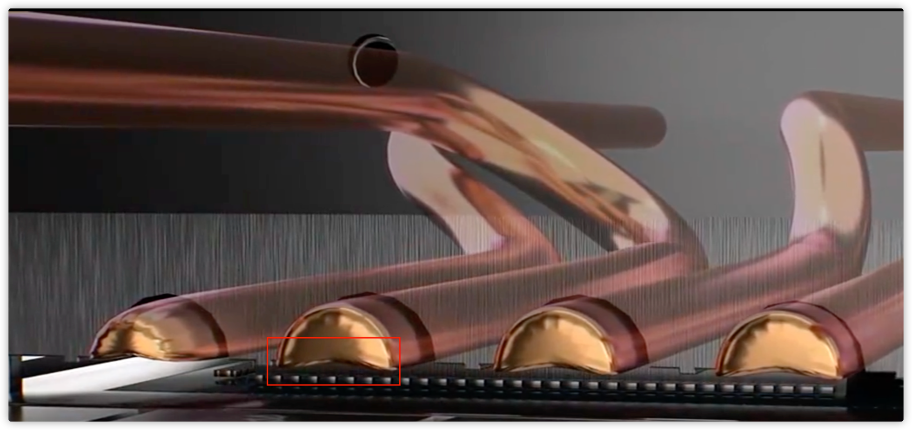
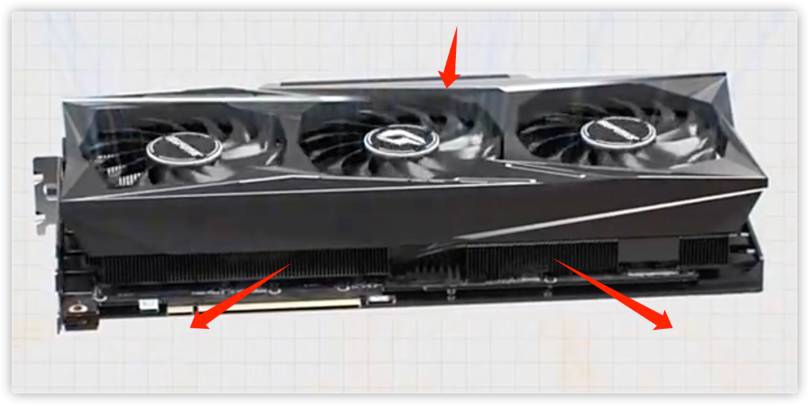
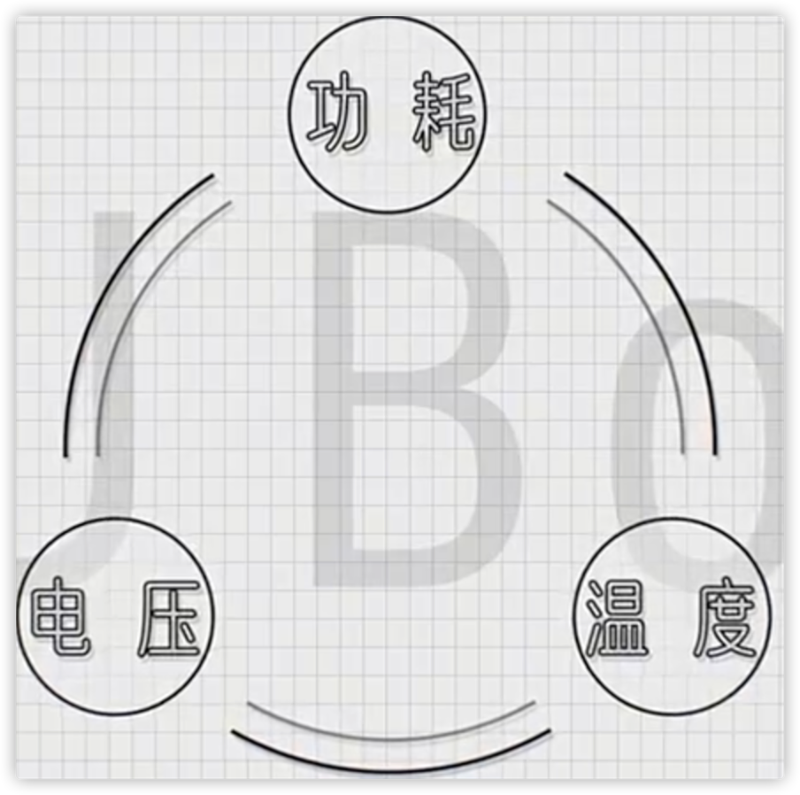

# GPU散热方式

## 被动散热
- 1997年, NVIDIA Riva 128显卡
  - 性能较低, 发热较低, 自然散热

- 1998年, NVIDIA Riva TNT显卡
  - 性能功耗提升, 铝制散热片, 纯被动散热

  - 铝片工艺
    - 挤铝工艺: 一大片铝块高温挤压塑型
    - 铸造工艺
    - 铲齿工艺
    - 切削工艺

## 主动散热: 鳍片+风扇
- 1999年, NVIDIA GeForce 256
  - 正式提出了GPU概念
  - 鳍片 + 4厘米风扇, 主动散热

## 主动散热: 热管+鳍片+风扇

### 热管(HEAT PIPE)
#### 构造
- 中空的铜管
- 内部填充相变冷却液
- 管子内部是烧结壁, 便于液体蒸发, 到冷区冷凝通过毛细现象返回热区
- 主流的热管规格是6mm 或 8mm
  - 热承载能力相差将近一倍

#### 热管数量
- 通常越多越好, 但是有边际效应
 
### 鳍片
- 热管与鳍片接触方式: 
  - 方式1: 穿Fin工艺
    - 热管直接插入鳍片内
    - 但长时间使用, 由于鳍片与热管热胀冷缩程度不同导致中间有缝隙, 从而影响散热效果
    - 工艺简单, 成本较低, 良品率高
  - 方式2: 回流焊工艺
    - 直接用金属焊料把热管与鳍片焊接起来

### 热管&GPU核心接触方案
- 热管直触方案: 
  - 问题1: 长时间热胀冷缩会导致空腔, 从而影响散热
  - 问题2: 热管壁打磨, 导致使用寿命变短

- 铜底方案:
  - 便于将热量均摊到各个热管上

- 均热板方案: 
  - 板状的热管, 内部也是液体蒸发, 气体冷凝传递热量

### 风扇
#### 下压式显卡
- 工作方式
  - 风扇面吸风
  - 四周出风
- 优点:
  - 安静
- 缺点:
  - 依赖机箱通风

#### 涡轮式显卡
- 缺点:
  - 转速偏高, 噪音偏大

## 水冷
- 由于GPU通常都比CPU面积要大, 因此水冷对于GPU相比对于CPU来说, 提升效果更加明显.

- 英伟达显卡都自带了GPU Boost, 自动超频机制
  - 出厂1700MHz的显卡, 往往跑在接近2000MHz频率上
  - 功耗, 电压, 温度
  - 更好的散热, 能让GPU Boost维持得更加稳定

# Refs
- [全网最详细显卡散热工作原理科普](https://www.zhihu.com/zvideo/1433777767221071872)
