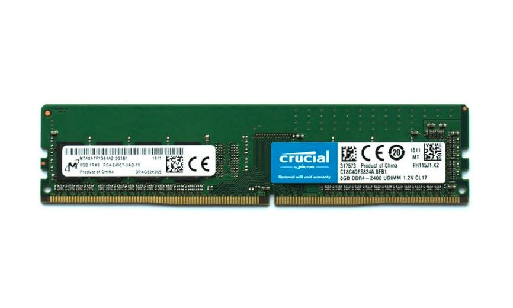
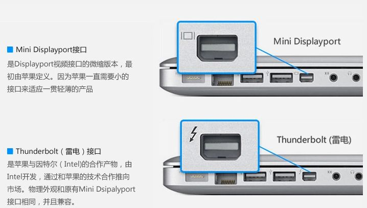
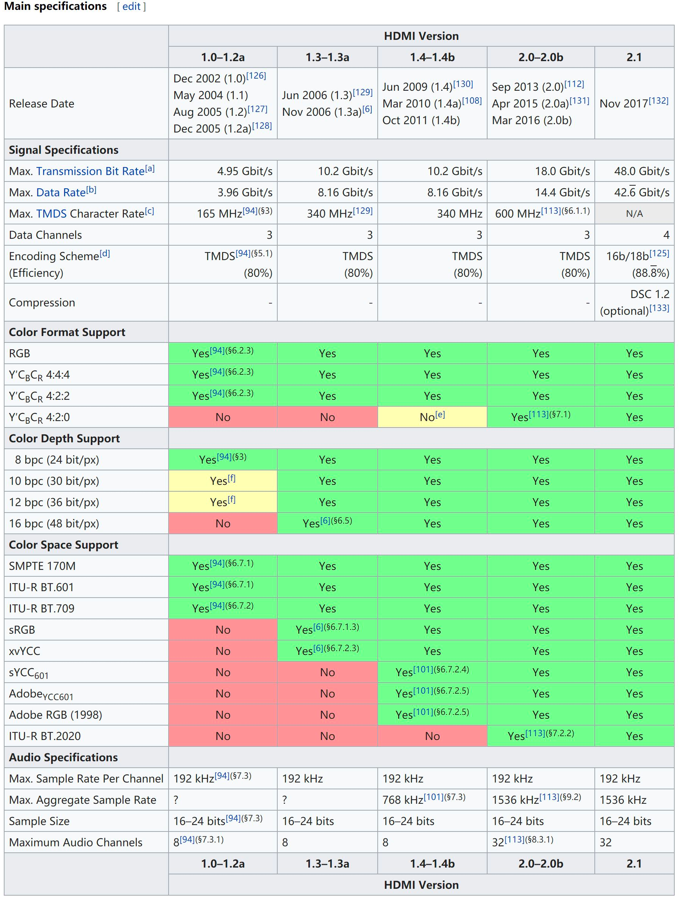

# 常见接口协议速度

---
## 内存接口
### DDR
- 内存的标准接口.
- DDR与DIMM区别:
  - DIMM是指针脚插槽, 也就是物理结构方面的分类
  - 而SDRAM和DDR都是内部技术方面的分类

#### Spec
|SDRAM/DDR	|型號	|資料寬度(bit)	|內部時脈(MHz)	|頻率速度	|頻寬(頻率x寬度)|
|  ----  | ----  |  ----  |  ----  |  ----  |  ----  |
|DDR	|DDR-266	|64	|133	|266	|2.1GBytes/sec	|
|DDR	|DDR-400	|64	|200	|400	|3.2GBytes/sec	|
|DDR	|DDR2-800	|64	|200	|800	|6.4GBytes/sec	|
|DDR	|DDR3-1600	|64	|200	|1600	|12.8GBytes/sec	|
|DDR	|DDR4-2133	|64	|200	|2133	|17.0GBytes/sec	|
|DDR	|DDR4-2400	|64	|200	|2400	|19.2GBytes/sec	|
|DDR	|DDR4-2666	|64	|200	|2666	|21.3GBytes/sec	|
|DDR	|DDR4-3200	|64	|200	|3200	|25.6GBytes/sec	|

#### DIMM接口图片

#### 疑问
- by 2021年, DDR4是主流, 2021年9月, SK Hynix出产第一批DDR5内存
- DDR2-800的速度基本上跟HDMI 2.1速度差不多了. 果然整体还是DDR速度最快

## 硬盘接口
### SATA
一般老的HDD硬盘(2021年), 都用SATA接口: 
#### Spec
|  版本   | 頻寬 (Gbit/s)  | 速度 (MByte/s) |
|  ----  | ----  |  ----  |
|SATA 1.0	|1.5	| 150 |
|SATA 2.0	|3		| 300 |
|SATA 3.0	|6		| 600 |

#### 样例

#### 图片

### PCIE/M.2接口

#### 总结
- 既是通道，也是接口

一般新的SSD硬盘(2021年), 显卡等, 都用PCIE接口:
- PCI-E体积太大
- M.2接口可以理解为就是PCI-E接口，只是换了个形状而已(但走的通道是PCIE通道)
- PCI-E接口目前最大的作用就是插显卡，除了显卡还有无线网卡，万兆有线网卡这些高带宽设备
- PCI-E接口也可以转接成很多接口，比如USB3.0，Type-c，雷电3，又或者U.2，M.2
- 当前(2021年12月)主流的是PCIE3

#### Spec
|  規格   | 1x頻寬  | 16x頻寬 |
|  ----  | ----  |  ----  |
|PCIe |1.0	|250MByte/s	|	4GByte/s|
|PCIe |2.0	|500MByte/s	|	8GByte/s|
|PCIe |3.0	|~1GByte/s	|~16GByte/s	|
|PCIe |4.0	|~2GByte/s	|~32GByte/s	|

#### 图片

## 外设
### USB
U盘等
#### Spec
|  版本   | 頻寬 (Gbit/s)  | 速度 (MByte/s) |
|  ----  | ----  |  ----  |
|USB |1.0	|12		|1.5 	|
|USB |2.0	|480	|60		|
|USB |3.0	|5G		|500	|
|USB |3.1	|10G	|1000 	|

#### 图片

### IDE

## 视频接口

### VGA
模拟信号

### DP(DisplayPort)

### 雷电(ThunderBolt)
#### Spec
|  版本   | 頻寬 (Gbit/s)  | 速度 (MByte/s) |
|  ----  | ----  |  ----  |
|Thunderbolt 1	|10000bps  |1.25GB  |
|Thunderbolt 2	|20000bps  |2.5GB 	|

#### 图片

### HDMI
#### Spec
* 2.1 标准: 48Gbps --> 6GB
* 2.0 标准: 18Gbps --> 2.25GB
  

#### 图片

# 例子

## HDMI传输分析 

---
- 单个像素点占用空间
  - 黑白二值图像, 一个像素只需要1bit
  - 256种状态的灰度图像, 需要8bit, 成为"真彩色", 称为色深(Color Depth), 色深的位数越高，越能细腻诠释色彩的色阶变化。 
  - 由于屏幕单个色块是由RGB组成, 因此 8*3=24bit
  - 因此色彩数量: 2^24=1670万色

选购显示设备时，会经常看见6bit、8bit、10bit等. 
当前(2021年)主流的是8bit

---
以4K清晰度, FPS 120Hz, 游戏为例, 需要传输的带宽是怎样的?
  - 4096*2160*24*120 = 25,480,396,800 bps =23.73 Gbps 即HDMI 2.0不够

## MacBook Pro分析

---
自己使用的电脑 
- MacBook Pro (Retina, 15-inch, Mid 2015), 
  - 256GB的SSD硬盘, 接口使用的SATA
  - 内置键盘, 触摸板, 使用USB 3.0
  - 2块1600MHz的DDR3 内存
  - 2个ThunderBolt 2.0接口
- MacBook Pro (Retina, 16-inch, Mid 2020), 使用的是256GB的SSD硬盘, 接口使用的Nvme

# Refs
- [各种通信接口速率](https://www.jianshu.com/p/1fc8c9926ac1)
- [PCI-E通道是个什么东西？他是干啥的？](https://www.zhihu.com/collection/212284966)

