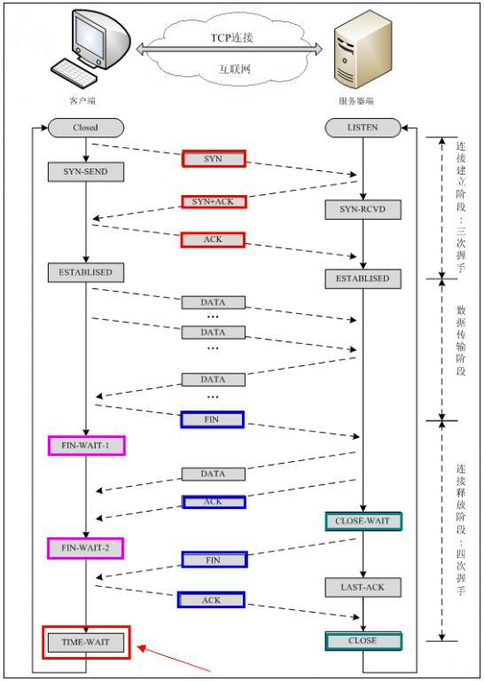

---
疑问: 从下图可以看出, 客户端可能会是TIME_WAIT状态. 但如果是服务端主动关闭的呢? 服务端可能会是TIME_WAIT状态么?

答案: 是可能的. 服务端主动关闭, 那么四次挥手的过程, 上图中客户端/服务端就要翻转下了. 

---
疑问: 为啥TIME_WAIT要持续2MSL?
- MSL: 最大分段生存期, 指明TCP报文在Internet上最长生存时间，每个具体的TCP实现都必须选择一个确定的MSL值。

TIME_WAIT状态必须要有一定的持续时间，所以TIME_WAIT也被称为2MSL等待状态，一般持续时间在1分钟到4分钟之间。
RFC793定义了MSL为2分钟，Linux设置成了30s

主要有两个原因：
1、我们没有任何机制保证最后的一个ACK能够正常送达, TIME_WAIT确保有足够的时间让对端收到了ACK，
    * 如果被动关闭的那方没有收到ACK，就会触发被动端重发Fin，
    * 从上图查看, ACK到服务端1个MSL, 服务端如果在MSL里没收到ACK, 则会重发FIN, FIN到达客户端. 
    * 上边ACK + FIN 耗时, 正好2个MSL；
2、有足够的时间让这个连接不会跟后面的连接混在一起（如果连接被重用了，那么这些延迟收到的包就有可能会跟新连接混在一起）。
    * 

我们经常就会在服务器上发现有很多的wait_timeout，特别常见的就是http服务器，从上面的描述来看，这个状态应该是主动关闭的一方，才会有的状态，我们有没有想过，就是为什么服务器端会主动断开连接呢？不应该是客户端主动断开吗？

据说，其实在最初的http协议，服务器在发送完客户端需要的内容后，就主动关闭连接，因为当时的客户端，需要等待所有效果渲染完毕，才会主动断开连接，为了照顾当时性能低下的服务器，更好的服务其他客户，才在协议中这样规定，说到底就是http协议太老了，所以Google才会推他的SPDY协议。

---
疑问: 实际上, 我们看到经常服务端会处于CLOSE_WAIT状态, 理论上CLOSE_WAIT应该持续时间很短, 为啥会经常处于这个状态?
解释: 出现大量close_wait的现象，主要原因是某种情况下对方关闭了socket链接，但是我方忙与读或者写，没有关闭连接。
    就是说CLOSE_WAIT时, 服务端还有数据要写给客户端, 所以没有给客户端发FIN 
    代码需要判断socket，一旦读到0，断开连接，read返回负，检查一下errno，如果不是AGAIN，就断开连接。
---
疑问: 可以从上图看出, 如果客户端在TIME_WAIT内重发了一次ACK, 但ACK还是没有被服务端收到, 那么服务端就会在LAST_ACK状态. 具体LAST_ACK会持续多久?
解释: LAST_ACK->CLOSE不靠超时. 加入服务端发送了FIN之后, 等待LAST_ACK. 
但客户端回复的ACK丢失了, 在MSL里, 服务端重新发送了FIN, 客户端收到之后, 重新发送ACK, 此时ACK重新丢失. 
客户端由于2MSL到期, 因此变为CLOSED状态; 
服务端重新发送FIN, 由于客户端已经处于CLOSED状态, 因此连接丢失, 客户端回复RST, B收到RST进入CLOSED状态.

---
疑问: 有啥最佳实践? 
高并发TCP服务器中进行主动关闭的一方最好是客户端：
- 因为对于高并发服务器来说文件描述符资源是很重要的资源，
- 如果对于每一个连接都要经历TIME_WAIT这个2MSL的时长，势必造成资源不能立马复用的浪费。
- 虽然对于客户端来说TIME_WAIT状态会占用端口和句柄资源，但是客户端一般很少有并发资源限制，所以客户端执行主动关闭是比较合适的。

服务器端程序最好启用SO_REUSEADDR选项：
- 我们想这样做一种情况，如果生产环境中服务端程序由于某种错误操作关闭了，我们肯定是要立马重启服务程序，
- 但是TIME_WAIT还在占用着这些地址端口资源让你的服务起不来，那你着不着急。
- SOREUSEADDR这个选项正是允许地址端口的重复绑定。

