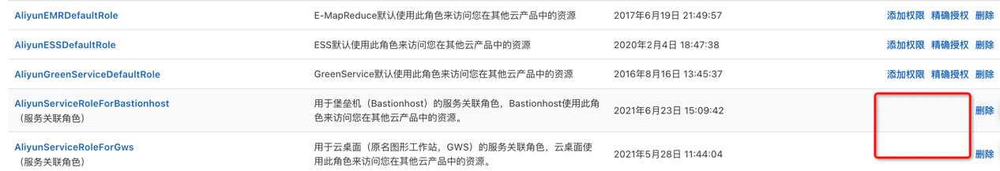

# 
### 重要概念: 

RAM用户:
- 主账号
- 子账号
用户组: 
- 与传统RBAC里的角色对应.
RAM角色: 
RAM里的角色与普通RBAC里的角色是不一样的, 这里的角色相当于是一个虚拟实体(虚拟用户), 没有ak/sk, 因此不能被直接使用. 
但可以被ram用户(子账号或主账号或者云产品云服务等)扮演(assume), 一旦扮演完成, 即可拥有该角色上的所有权限.

### 重要属性
- 权限管理: 用来设置该角色拥有哪些权限.
- 信任策略管理: 用来管理哪些RAM用户/服务能够扮演(assume)该角色

### 角色分类
#### 普通角色
- 用户可以自己创建角色, 并设置"信任策略管理"
- 也可以由用户开通云服务时, 授权云服务来为用户创建该角色, 并把云服务加入到"信任策略"里. 从而云服务可以扮演该角色.

#### SLR(ServiceLinkedRole, 服务关联角色)
相当于普通角色的升级版, 主要是给云服务使用. 
与普通角色的区别是: SLR一旦创建成功, 用户不能再添加/修改SLR的 "权限管理" 以及 "信任策略管理". 只能删除. 
优点是防止用户误修改权限/信任策略, 导致云服务无法正常扮演, 提供服务.

# 基本API使用
## 方式1: 直接使用AK/SK
### 使用样例: 
- 使用主账号的AK/SK
- 使用子账号的AK/SK 

### 适用场景分析
直接用ak/sk, 是非常常见的方案. 但带来的问题: 
1. SK泄露安全问题: 由于SK是不变的, 因此如果SK泄露, 相当于密码泄露, 即永久地拥有了该账号所有的权限.
2. SK永久有效问题: 主账号的SK是

## 方式2: 扮演RAM角色, 使用RAM角色的STSToken

### 使用样例

### 使用场景分析
由于stsToken有效期用户是可以设置的, 因此风险有限.

## 方式3: 内部调用使用innerAPI

### 使用场景分析
为二方/云产品颁发一个授信的AK/SK, 在调用API时, 可以传入 (ak, sk, realUserId) 来代理用户执行操作

### 缺点
- 安全要求高: 
  - 链路安全需要保障: 一定要保障API链路是走的安全链路或者内网通道, 不要开放在公网.
  - 云产品ak/sk需要保障: 不要放在客户端, 一定要放在服务端. API只能`服务端-服务端`调用
- 流控方式: 需要按照<api, realUserId, channel>为粒度进行流控.
  - 如果按照<api, 云产品UID>进行流控, 云产品如果代理的realUserId数量增加, 会很容易到达限流瓶颈. 
  - 如果按照<api, realUserId>进行流控, 在云产品错误调用量很大时, 会导致影响用户正常的api调用

# 其他思考
## 最佳实践
1. 一定要用子账号的ak/sk, 不能用主账号. 子账号ak/sk泄露, 可以通过主账号进行禁用等. 一旦主账号sk泄露, 就彻底没有了防线.
2. 作为第三方服务开发者, 一定要使用SLR来请求进行授权, 而不能直接索要用户的ak/sk, 或者请求用户添加子账号之类.

# Refs
- [CreateServiceLinkedRole](https://next.api.aliyun.com/document/Rds/2014-08-15/CreateServiceLinkedRole)
- [Java SDK：使用STS Token进行访问](https://developer.aliyun.com/ask/213942?spm=5176.21213303.J_6704733920.26.5c103eda7AvbNH&scm=20140722.S_community%40%40%E9%97%AE%E7%AD%94%40%40213942._.ID_community%40%40%E9%97%AE%E7%AD%94%40%40213942-RL_sts%20token-LOC_main-OR_ser-V_2-P0_6)

