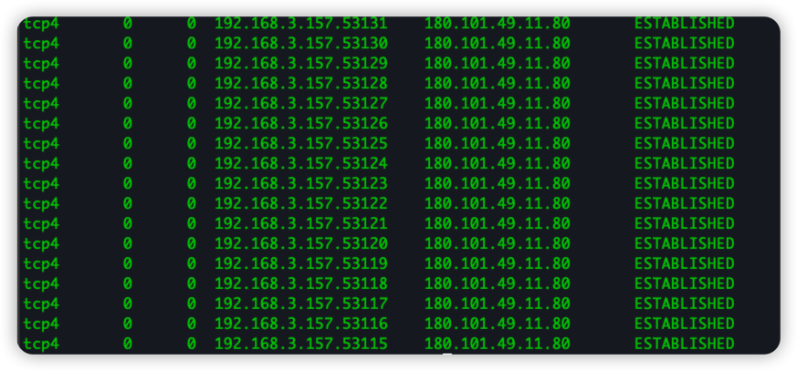

# 背景
```java
<dependency>
    <groupId>com.ning</groupId>
    <artifactId>async-http-client</artifactId>
    <version>1.9.40</version>
</dependency>
<dependency>
    <groupId>io.netty</groupId>
    <artifactId>netty</artifactId>
    <version>3.10.6.Final</version>
</dependency>
```

# AsyncHttpClient 重要参数与使用指南
## 重要参数
```java
allowPoolingConnections
```

## 使用指南


## 最佳实践
### IO线程池最好不要用CachedThreadPool-->此处存疑, 暂时无法复现任务被Rejected场景
- 如下样例, ioThread线程池只有10, 并发的请求有100, 由于`Executors.newCachedThreadPool`内部使用`SynchronousQueue`, 从而导致突发的请求会被Reject掉.
- 如果要用也要评估好容量, size一定要大于, 防止Reject请求??
```java
public void init() {
        ExecutorService ioThreadPool=Executors.newCachedThreadPool(new DefaultThreadFactory(workerThreadPoolName));
        builder.setExecutorService(ioThreadPool);

// boss
        String bossThreadPoolName="AsyncHttpClient-Dispatcher";
        ExecutorService bossThreadPool=Executors.newFixedThreadPool(1,new DefaultThreadFactory(bossThreadPoolName));

        NioClientSocketChannelFactory socketChannelFactory=new NioClientSocketChannelFactory(
        bossThreadPool,ioThreadPool,1,10);
// ...
}
public void postTest() throws InterruptedException {
    init();
    String url = "http://www.baidu.com/";
    for (int i = 0; i < 100; i++) {
        doAsyncGet(url);
    }
    Thread.sleep(100000L);
}

```


### 单独定义Worker线程池, 与IO线程池分开
如下, 在`onCompleted()`里执行时, 本质上还是在IO线程里执行, 此时TCP连接仍然是ESTABLISHED状态.
只有当`onCompleted()`方法执行完成, 底层的TCP连接才会或者放回连接池中(allowPoolingConnections=true, 以便其他请求复用), 或者关闭(allowPoolingConnections=false)
如果在`onCompleted()`里执行很耗时的操作, 就会
1. 占用着TCP连接无法复用/关闭, 造成资源浪费.
2. 占用IO线程, 导致其他IO任务等待.
由于此时http response已经完全读取完毕, 因此可以将response丢进worker线程池中, 执行耗时的业务操作. 从而把TCP连接复用/关闭.
如下样例, 导致100个TCP连接一直处于ESTABLISHED状态
---
```java
public static class CommonCallback extends AsyncCompletionHandler {
  @Override
  public Object onCompleted(Response response) throws Exception {
    System.out.println(Thread.currentThread().getName() + " " + Calendar.getInstance().getTimeInMillis() + " hello");
    // 此时TCP连接仍然是ESTABLISHED状态
    Thread.sleep(5 * 60 * 1000L);
    return response;
  }
}
```


### 当设置了maxConnectionsPerHost时, allowPoolingConnections最好设置为true, 并且请求最好不要瞬时并发
否则如下例子, 请求就不会排队了, TCP连接也无法重用, 直接进入了Handler的`onThrowable()`方法里
```java
for (int i = 0; i < 100; i++) {
    doAsyncGet(url);
    // 这里最好根据平均处理时长, 设置一个sleep时长, 便于TCP连接回收回池子里, 从而不超过maxConnectionsPerHost阈值
}
```

# AsyncHttpClient 参数适用场景
## 场景1: 与较少数量的Server, 通信频繁或者有大量数据要传输, 需要维持TCP长连接
- 本质上来说就是当建立/维持TCP连接的成本高于传输成本时, 可以选择长连. 不论是TCP长连接, 还是HttpClient基于TCP的连接复用.
- 实际场景: 
  - 大文件的下载(基于HTTP/TCP协议)
  - HTTP/1.1, 即访问某个网站时, 短时间内需要往该Host发送N多HTTP请求.
```java
allowPoolingConnections = true;
pooledConnectionIdleTimeout = 10 * 1000; // 设定池子里空闲TCP连接的保持时间, 大于该时长, 则TCP连接被关闭, 从连接池中移除
// maxConnectionsPerHost = 100; // 设定往每个HOST的最大可以连接数量, 大于该连接的请求, 会进入到Handler的onThrowable里 (这里HOST是{HOST_IP, PORT} 还是 HOST_IP? 待验证)
```
## 场景2: 与较多数量的Server, 每个Server传输较少的数据, 可以不用连接复用, 使用TCP短连接
- 实际场景: 
  - 爬虫, 需要爬取N多个Server的标题/概要信息, 构成网站地图, 每个Server/Host的内容量较少. (当然如果是单个Server有N多内容要爬取, 也可以使用长连接)
- 实际参数: 
```java
allowPoolingConnections = false; // 没必要把TCP连接放进池子里, 因为后续短期大概率就不会再跟该Host建立TCP连接

```

# AsyncHttpClient & Netty


# AsyncHttpClient & 其他Provider

## AsyncHttpClient & JDK

# Refs
- 详细的测试样例: [HttpAsyncClientTest.java](https://gitee.com/null_894_2517/test-core/blob/d504b14564ef7d6e2ee4a2b3a8379f62cdf894ee/src/test/java/edu/xmu/test/javaweb/httpclient/HttpAsyncClientTest.java)


