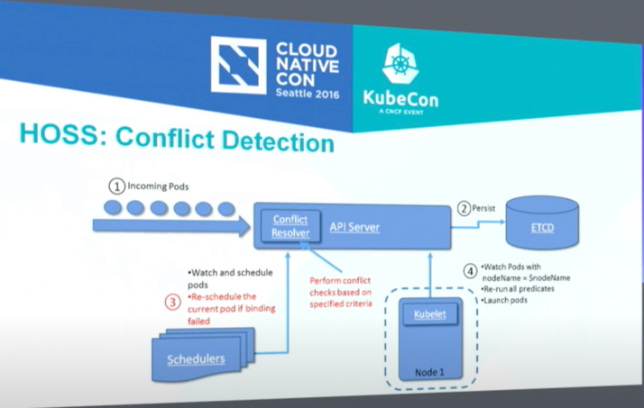
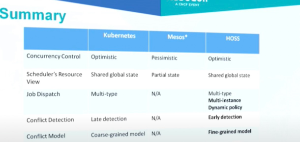

# 总结

## 关于kube-scheduler的资源记账: 
### 以为的记账流程: 
- 研究kube-scheduler代码, 关于nodeInfo里资源的记账, 总是有个误解, 以为会分为三个部分: 
  - node上全量资源(totalCpu, totalMem)
  - node上已经确定占用的资源(usedCpu, usedMem)
  - 调度完成, node上待绑定的资源(assumedCpu, assumedMem), 实际绑定成功/失败未知, 只是for调度使用:  
    - 当绑定成功, 会收到事件, 将assumedCpu/Mem清理, 并把assumedCpu/Mem 放到usedCpu/usedMem里
    - 当绑定失败, 会收到事件, 将assumedCpu/Mem清理, 不叠加到usedCpu/usedMem里.
### 实际的记账流程参照文章 [Node allocatable资源的含义](https://www.mgasch.com/2017/10/sched-reconcile/)
- 但实际上kube-scheduler, 把nodeInfo分为2部分:
  - node上全量资源(NodeInfo.Allocatable), 注意之前经常会搞混, 以为allocatable = total - used; 实际上allocatable代表total. 实际发现其他同学也有理解错的: [Allocatable Resources is calculated wrong](https://github.com/kubernetes-sigs/kube-batch/issues/881)
  - node上已经占用的资源(NodeInfo.Requested), 包括如下2部分: 
    - node上已经确定占用的资源
    - 调度完成, node上待绑定的资源(assumedCpu, assumedMem)
  - 实际的对账过程: 
    - 当调度成功, bind前, 会直接把pod.request叠加到node.requested里.
    - bind成功, (修改pod状态), node.requested不变
    - bind失败, 1秒一次的轮询, 更新pod状态, 将pod的资源归还回node.requested里
    - kube-scheduler重启: 会
### 引发的问题
- kube-scheduler重启, 会执行一次fullsync, cache同步更新量会很大, 耗时可能会比较久, 这中间scheduler是不提供服务的
- 如果多个scheduler同时工作, 由于不共享requestedResource, 并发场景下, 导致资源超卖: 

    - 当前解决方案: 

### 如何改进/使用多个scheduler
HOSS方案: 
#### Part1: Job dispatch:
1. instanceLevel load balancing: 防止某些scheduler非常繁忙, 某些scheduler非常空闲.
2. dynamic scheduling policy: 基于scheduler的标签, 进行调度


方案总结: 即新增scheduler-controller模块, 对多个scheduler进行进一步调度

#### Part2: Conflict resolution:
1. 


方案总结: 即在api-server增加conflict-resolver模块, 识别binding的request, 进行冲突校验, 进行failfast.

#### HOSS与kube-scheduler的对比


# Refs

[Node allocatable资源的含义](https://www.mgasch.com/2017/10/sched-reconcile/)
[Running Multiple Schedulers in Kubernetes by Xiaoning Ding, Huawei](https://www.youtube.com/watch?v=avORKrcyctM)


```shell
echo "Hello world! ecs"
```

```java
public static class Hello {
    public static void main() {
        System.out.println("Hello world, abc!");
    }
}
```

> 苟利国家生死以
> 岂因祸福避趋之。<br>
> One should uphold his country’s interest with his life, he should not do things just to pursue his personal gains and he should not be evade responsibilities for fear of personal loss.

# Hello

## Hello 2

# Title 3

## Hello 3


Under what circumstances should we step off a path? When is it essential that we finish what we start? If I bought a bag of peanuts and had an allergic reaction, no one would fault me if I threw it out. If I ended a relationship with a woman who hit me, no one would say that I had a commitment problem. But if I walk away from a seemingly secure route because my soul has other ideas, I am a flake?

The truth is that no one else can definitively know the path we are here to walk. It’s tempting to listen—many of us long for the omnipotent other—but unless they are genuine psychic intuitives, they can’t know. All others can know is their own truth, and if they’ve actually done the work to excavate it, they will have the good sense to know that they cannot genuinely know anyone else’s. Only soul knows the path it is here to walk. Since you are the only one living in your temple, only you can know its scriptures and interpretive structure.

At the heart of the struggle are two very different ideas of success—survival-driven and soul-driven. For survivalists, success is security, pragmatism, power over others. Success is the absence of material suffering, the nourishing of the soul be damned. It is an odd and ironic thing that most of the material power in our world often resides in the hands of younger souls. Still working in the egoic and material realms, they love the sensations of power and focus most of their energy on accumulation. Older souls tend not to be as materially driven. They have already played the worldly game in previous lives and they search for more subtle shades of meaning in this one—authentication rather than accumulation. They are often ignored by the culture at large, although they really are the truest warriors.

A soulful notion of success rests on the actualization of our innate image. Success is simply the completion of a soul step, however unsightly it may be. We have finished what we started when the lesson is learned. What a fear-based culture calls a wonderful opportunity may be fruitless and misguided for the soul. Staying in a passionless relationship may satisfy our need for comfort, but it may stifle the soul. Becoming a famous lawyer is only worthwhile if the soul demands it. It is an essential failure if you are called to be a monastic this time around. If you need to explore and abandon ten careers in order to stretch your soul toward its innate image, then so be it. Flake it till you make it.
