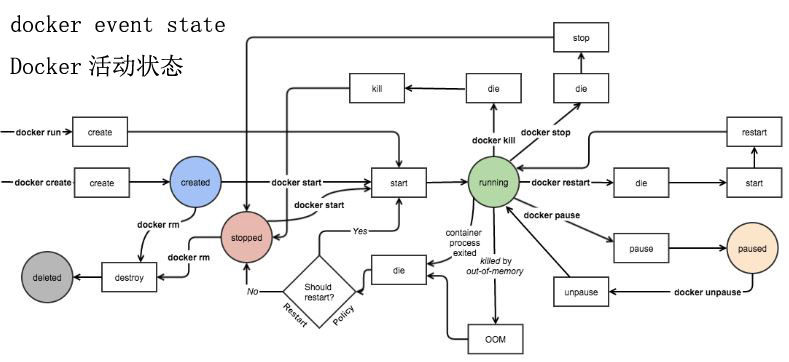
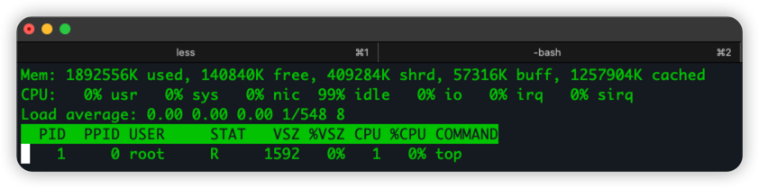
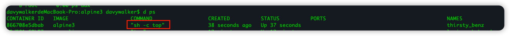

# 总结
1. 在Linux上的Docker, 本质上是使用了
   1. `cgroups`: 本质上是Linux内核提供的资源Quota约束机制, 包括cpu/mem/io等
   2. `namespace`: [命名空间](https://yeasy.gitbook.io/docker_practice/underly/namespace), 包括pid, net, ipc, mnt(文件目录root), uts, user(即username, group等)  
   3. `UnionFS`: 是 Docker 镜像的基础。镜像可以通过分层来进行继承，基于基础镜像（没有父镜像），可以制作各种具体的应用镜像。
   4. 操作系统等, 本质是共享内核, 所以不需要操作系统进行虚拟化. 可以认为每个Docker容器只是一个很轻量的文件目录&资源隔离
   5. 只能创建linux类docker
   6. 每个Docker容器, 在Linux上就是一个进程. 但如果Docker容器内部, 本身启动了多个进程, 例如Nginx容器启动3个进程, 那么在Host上表现为啥?
> It is generally recommended that you separate areas of concern by using one service per container. 
> That service may fork into multiple processes (for example, Apache web server starts multiple worker processes). 
> It’s ok to have multiple processes, but to get the most benefit out of Docker, avoid one container being responsible for multiple aspects of your overall application. 
> You can connect multiple containers using user-defined networks and shared volumes.

2. 在Mac上的Docker 
   1. 同样用虚拟化技术xhyve或者virtualbox来实现, 不共享mac os内核。
   2. 只能创建linux类docker，不能创建Mac OSX的docker. update 2022, [Docker-OSX](https://github.com/sickcodes/Docker-OSX) 项目可以了. 但本质上也是使用了KVM虚拟机.
3. Windows的Docker
   1. 不能在Linux机器上使用windows的docker镜像. 参见: [can-windows-containers-be-hosted-on-linux](https://stackoverflow.com/questions/42158596/can-windows-containers-be-hosted-on-linux)
      1. 因为docker在Linux上本质是使用了Linux HostOS的 `cgroups` `namespace` 等. 而Windows
   2. 可以在Windows机器上使用Linux的docker镜像, 例如可以创建`alpine` `busybox` 等
      1. 因为本质上是在Windows机器上创建了一个Linux的虚拟机, 而Linux的Docker全都是基于该虚拟机的. 
4. Running/Stopped的容器, 其镜像是不能被删除的(除非强制删除). 启动容器的时候, 需要重新使用镜像作为模板.
5. Docker vs. VM
> 前台执行和后台执行的问题：
Docker 不是虚拟机，容器中的应用都应该以前台执行，而不是像虚拟机、物理机里面那样，用 start / systemctl 去启动后台服务，容器内没有后台服务的概念。
比如：如果我们将CMD 写成这样：
CMD service nginx start
然后会发现容器执行后就立刻退出了，甚至在容器内使用systemctl 命令结果却发现根本执行不了。这就是因为没有搞明白前台、后台的概念，没有区分容器和虚拟机的差异，依旧在以传统虚拟机的角度去理解容器
对于容器而言，其启动程序就是容器应用进程，容器就是为了主进程而存在的，主进程退出，容器就失去了存在的意义，从而退出，其它辅助进程不是它需要关心的东西。
而使用 service nginx start 命令，则是希望 start 来已后台守护进程形式启动nginx服务。而 CMD service nginx start 会被理解为 CMD ["sh", "-c", "service nginx start"]，因此主进程实际上是sh， 那么当service nginx start 命令结束后，sh 也就结束了， sh 作为主进程退出了，自然就会令容器退出。
正确的做法是直接执行 nginx 可执行文件，并且要求以前台形式。如：
CMD ["nginx", "-g"," daemon off;"]


# 疑问与思考
1. Docker容器中的多个进程, 在Host上看起来是怎样的? 
2. Docker镜像在Host上存放的路径是哪里?
   1. MacOS: `~/Library/Containers/com.docker.docker/Data/vms/0/`
3. Docker容器的生命周期是怎样的? 为啥Stop之后还需要Remove掉? 如果不Remove, 会怎样?
4. 该选用哪个/哪种镜像作为基础系统镜像? 参见: [comparison-linux-container-images](http://crunchtools.com/comparison-linux-container-images/) 

# 深入机制探讨与研究
## 镜像Cache机制
看了Docker官方文档关于 [layer-caching](https://docs.docker.com/get-started/09_image_best/#layer-caching) 的介绍, 不太理解具体怎么判断是否需要使用缓存.
还好 [docker build 的 cache 机制](http://open.daocloud.io/docker-build-de-cache-ji-zhi/) 文章很清晰地解释了这个疑问. 这里自己总结下: 
### 原始的Dockerfile如下 
```shell
FROM node:12-alpine
# Adding build tools to make yarn install work on Apple silicon / arm64 machines
WORKDIR /app
COPY . .
RUN yarn install --production
CMD ["node", "src/index.js"]
```
存在的问题:
1. 由于第二层是 `COPY . .` 因此根据如下原则
> 判断 ADD 命令或者 COPY 命令后紧接的文件是否发生变化，则成为是否延用 cache 的重要依据。
> Docker 采取的策略是：获取 Dockerfile 下内容（包括文件的部分 inode 信息），
> 计算出一个唯一的 hash 值，若 hash 值未发生变化，则可以认为文件内容没有发生变化，可以使用 cache 机制；反之亦然。
2. 即使我们只修改了应用的某个static/js文件, 没有修改node的依赖(即package.json), 第二层`COPY . .`是不会命中缓存的
3. 因此根据如下原则,第三层`RUN yarn install --production`也不会命中缓存, 需要重新进行依赖的安装, 从而构建出新的镜像层次(Image Layer), 而这个是很耗时的操作.
> Once a layer changes, all downstream layers have to be recreated as well

### 改进的Dockerfile如下: 
```shell
FROM node:12-alpine
WORKDIR /app
COPY package.json yarn.lock ./
RUN yarn install --production
COPY . .
CMD ["node", "src/index.js"]
```
好处分析: 
1. 如果`package.json`文件修改, 那么由于文件hash值变化, 因此第二层`COPY package.json yarn.lock ./`必然失效, 从而第三层也失效, 进入耗时的`yarn install`阶段, 符合预期.
2. 如果`package.json`文件未修改, 只是修改了应用的某个static/js文件, 那么第二层`COPY package.json yarn.lock ./`必然不会失效, 从而第三层也不会失效, 从而跳过了耗时的`yarn install`阶段, 最大化地利用了缓存.

### RUN 命令存在外部依赖
如果RUN命令存在外部依赖, 如
`RUN apt-get update`
`RUN git clone -q https://github.com/docker-in-practice/todo.git`
等.
那么随着时间的推移, 
- 一年的 apt-get update 和一年后的 apt-get update, 由于软件源软件的更新, 从而导致产生的镜像理论上应该不同. 
- `todo.git`代码库进行了更新push
如果继续使用 cache 机制, 将存在不满足用户需求的情况.
在这种情况下, 在构建镜像时可以强制不使用缓存, 这样每层构建时均不使用缓存:  
```shell
docker build --no-cache -t getting-started .
```

## [多阶段构建](https://yeasy.gitbook.io/docker_practice/image/multistage-builds)
Dockerfile 多阶段构建


## 镜像构建缓存利用的最佳实践
- 应该将更多静态的安装&配置命令尽可能地放在 Dockerfile 的较前位置, 如: 
```shell
FROM node:12-alpine
WORKDIR /app
COPY package.json yarn.lock ./
RUN yarn install --production
COPY . .
CMD ["node", "src/index.js"]
```
- [尽量将RUN命令在一行中执行](https://www.cnblogs.com/yanjieli/p/10246117.html)以减少镜像的层次, 如
```shell
FROM centos
#RUN yum install -y gcc make cmake
#RUN wget -O redis.tar.gz "http://download.redis.io/releases/redis-3.2.5.tar.gz" 
#RUN mkdir -p /usr/src/redis
#RUN tar xf redis.tar.gz -C /usr/src/redis --stript-components=1
#RUN cd /usr/src/redis
#RUN make
#RUN make install
#替换成一行:
RUN yum install -y gcc make cmake \
    && wget -O redis.tar.gz "http://download.redis.io/releases/redi s-3.2.5.tar.gz"  \
    && mkdir -p /usr/src/redis \
    && tar xf redis.tar.gz -C /usr/src/redis --stript-components=1 \
    && cd /usr/src/redis \
    && make \
    && make install
```

- 尽可能的使用 COPY，因为 COPY 的语义很明确，就是复制文件而已，而 ADD 则包含了更复杂的功能，其行为也不一定很清晰。
> 比如 <源路径> 可以是一个 URL，这种情况下，Docker 引擎会试图去下载这个链接的文件放到 <目标路径> 去。
> 下载后的文件权限自动设置为 600，如果这并不是想要的权限，那么还需要增加额外的一层 RUN 进行权限调整，
> 另外，如果下载的是个压缩包，需要解压缩，也一样还需要额外的一层 RUN 指令进行解压缩。
> 所以不如直接使用 RUN 指令，然后使用 wget 或者 curl 工具下载，处理权限、解压缩、然后清理无用文件更合理。
> 因此，这个功能其实并不实用，而且不推荐使用。

- 尽可能使用[多阶段构建](https://yeasy.gitbook.io/docker_practice/image/multistage-builds)
- 尽可能减少镜像层次

- [慎用 docker commit](https://yeasy.gitbook.io/docker_practice/image/commit#shen-yong-docker-commit), 否则会形成黑箱镜像

# 常用命令
## 容器
容器生命周期
--- 


容器命令
---
* 使用镜像创建容器
  * v: 挂载volume
```shell
docker create -p 3000:3000 --name <the-container-id> <the-image-id>
docker create -p 3000:3000 -v <the-volume-id>:<mount-point> --name <the-container-id> <the-image-id>
```

* 查看运行的容器
    * 查看运行中的容器

```shell
docker ps
CONTAINER ID   IMAGE                    COMMAND                  CREATED         STATUS         PORTS                                       NAMES
d2c016a1e2ab   getting-started          "docker-entrypoint.s…"   2 minutes ago   Up 2 minutes   0.0.0.0:3000->3000/tcp, :::3000->3000/tcp   confident_bouman
```
    * 查看所有容器(包括Stopped)

```shell
docker ps -a
docker container ls -a
```
    * 查看容器Command完整列表

```shell
docker ps --no-trunc
```

    * 查看容器详情

```shell
docker inspect <the-container-id>
```

* 登录容器
  * -i, --interactive 保持STDIN打开，即使没有连接
  * -t, --tty 分配一个pseudo-TTY

```shell
docker exec -it <the-container-id> /bin/sh
docker exec -it <the-container-id> /bin/bash
```


* 启动容器

```shell
docker start <the-container-id>
```


* 使用镜像创建&启动容器
  * -d - run the container in detached mode (in the background)
  * -p 80:80 - map port 80 of the host to port 80 in the container
  * -t Allocate a pseudo-TTY
  * -i interactive mode

```shell
docker run -dp 3000:3000 <the-image-id>
docker run -it busybox
```

* 停止容器

```shell
docker stop <the-container-id>
```

* 删除容器

```shell
docker rm <the-container-id>
```

* 使用容器创建快照/镜像

```shell
docker commit <the-container-id> <the-image-id>
docker commit <the-container-id> <your-docker-namespace>/<the-image-id>
```


## 镜像
* 通过源文件Dockerfile构建镜像
  * -t: tag image
  * . : tells that Docker should look for the Dockerfile in the current directory
```shell
docker build -t getting-started .
```


* 查看镜像列表

```shell
docker image ls
REPOSITORY               TAG       IMAGE ID       CREATED       SIZE
getting-started          latest    79b4eb26b9f4   4 hours ago   404MB
```

* 把镜像push到hub
```shell
docker tag <the-image-id> <your-docker-namespace>/<the-image-id>
docker push <your-docker-namespace>/<the-image-id>
```

* 删除镜像

```shell
docker rmi <the-image-id>
```


* 通过源文件Dockerfile构建镜像

* 检查镜像内容

```shell
docker inspect <the-image-id>
```

* 查看镜像继承关系
* 查看镜像历史版本


## volume

* 创建
```shell
docker volume create <volume-name>
```

* 查看列表
```shell
docker volume ls
```

* 查看详情 
  * Mountpoint: 代表在Host上的实际路径, 但实际在mac上由于是虚拟机, 因此并不准确
```shell
docker volume inspect <volume-name>
```


## Dockerfile文件
### exec模式与shell模式
- exec模式: 容器中的任务进程就是容器内的1号进程, 如下看到的1号进程是top
```shell
FROM alpine
CMD ["top"]
```



exec 模式的特点是不会通过 shell 执行相关的命令，所以像 $HOME 这样的环境变量是取不到的：
```shell
FROM alpine
CMD ["echo", "$HOME"]
```
可以修改成: (这样本质上bash进程就是1号进程了, 跟shell模式一样了)
```shell
FROM alpine
CMD ["sh", "-c", "echo $HOME"]
```

- shell模式: 容器中的1号进程是bash进程
```shell
FROM alpine
CMD top
```
本质上是翻译成了: 
```shell
FROM alpine
CMD ["sh", "-c", "top"]
```


### CMD模式与ENTRYPOINT模式

#### CMD模式
CMD 指令的目的是：为容器提供默认的执行命令。
CMD 指令有三种使用方式，
1. 为 ENTRYPOINT 提供默认的参数：

```shell
CMD ["param1","param2"]
```

2. exec 模式

```shell
CMD ["executable","param1","param2"]    // 这是 exec 模式的写法, 注意需要使用双引号
```

3. shell 模式：

```shell
CMD command param1 param2                  // 这是 shell 模式的写法
```

#### ENTRYPOINT模式
ENTRYPOINT 指令有两种使用方式: 
- exec 模式

```shell
ENTRYPOINT ["executable", "param1", "param2"]   // 这是 exec 模式的写法, 注意需要使用双引号
```

- shell 模式

```shell
ENTRYPOINT command param1 param2                   // 这是 shell 模式的写法
```

> 指定 ENTRYPOINT  指令为 exec 模式时，命令行上指定的参数会作为参数添加到 ENTRYPOINT 指定命令的参数列表中

```shell
FROM alpine
ENTRYPOINT [ "top", "-b" ]
```

```shell
docker run --rm test1 -c
// 最终结果是 top -b -c, 即-c被append为了新的参数
```

> 由 CMD 指令指定默认的可选参数

```shell
FROM alpine
ENTRYPOINT [ "top", "-b" ]
CMD [ "-c" ] // 默认参数
```

```shell
docker run --rm test1
// 最终结果是 top -b -c, 即-c被append为了新的参数
```


```shell
FROM alpine
ENTRYPOINT [ "top", "-b" ]
CMD [ "-c" ] // 默认参数
```

```shell
docker run --rm test1 -n 1
// 最终结果是 top -b -n 1, 即由CMD中指定的默认参数被命令行中的参数替换掉了
```

> 指定 ENTRYPOINT  指令为 shell 模式时，会完全忽略命令行参数

```shell
FROM alpine
ENTRYPOINT echo $HOME 
```

```shell
docker run --rm test1 ls
// ls 命令没有执行, 被忽略掉了
```

> 覆盖默认的 ENTRYPOINT 指令

```shell
FROM alpine
ENTRYPOINT echo $HOME 
```

```shell
docker run --rm --entrypoint ls test1
// ls执行了, 覆盖掉了原始dockerfile中的entrypoint
```


#### 总结
对于 CMD 和 ENTRYPOINT 的设计而言，多数情况下它们应该是单独使用的。当然，有一个例外是 CMD 为 ENTRYPOINT 提供默认的可选参数。
我们大概可以总结出下面几条规律：
• 如果 ENTRYPOINT 使用了 shell 模式，CMD 指令会被忽略。
• 如果 ENTRYPOINT 使用了 exec 模式，CMD 指定的内容被追加为 ENTRYPOINT 指定命令的参数。
• 如果 ENTRYPOINT 使用了 exec 模式，CMD 也应该使用 exec 模式。


# Refs
- [容器核心:cgroups](https://www.jianshu.com/p/052e3d5792ee)
- [Docker-从入门到实践](https://yeasy.gitbook.io/docker_practice/underly/ufs)
- [万字长文：彻底搞懂容器镜像构建](https://moelove.info/2021/03/14/%E4%B8%87%E5%AD%97%E9%95%BF%E6%96%87%E5%BD%BB%E5%BA%95%E6%90%9E%E6%87%82%E5%AE%B9%E5%99%A8%E9%95%9C%E5%83%8F%E6%9E%84%E5%BB%BA/)
- [Dockerfile 中的 CMD 与 ENTRYPOINT](https://www.cnblogs.com/sparkdev/p/8461576.html)
- https://segmentfault.com/a/1190000016137548