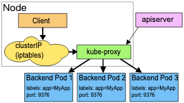

# k8s网络模型

如下三点是基础要求: 
```
1. 容器之间要求不需要任何NAT能直接通信
2. 容器与Node之间要求不需要任何NAT能直接通信
3. 容器看到自身的IP和外面看到它的IP必须是一样的, 即不存在IP转化的问题
```

# k8s三类IP
Kubernetes 集群内部存在三类 IP，分别是：

```shell
Node IP：宿主机的 IP 地址
Pod IP：使用网络插件创建的 IP（如 flannel），使跨主机的 Pod 可以互通
Cluster IP：虚拟 IP，通过 iptables 规则访问服务
```
安装 node 节点的时候，节点上的进程是按照 flannel -> docker -> kubelet -> kube-proxy 的顺序启动

# 总结
看了这么多文章, 终于理解了kube-proxy的深入原理以及发展历史:
1. 本质上是运行在每个host上的proxy流量转发服务. 从集群内部发起时流量转发规则生效.
2. 注意不是网关!!! 即不能处理k8s集群外部curl serviceip:port/xxx 的请求, 只能路由&处理集群内部的请求, 例如从host节点curl, 或者从pod内部curl. 是从AHost转发到BHost的. 这点是一直搞混的~
3. 历史总结下来:
    1. 数据面: 核心的转发功能
        1. 基于iptables+用户空间转发
        2. 基于iptables 即纯内核空间的路由规则
        3. 可以基于ipvs/lvs进行路由转发.
    2. 控制面: 主要做的是watch apiserver, 随时更新转发规则.



因此也明白了官方kube-proxy原理这张图里, 为啥Client始终在Host上. 
因为client必须在k8s集群里, 而集群里每个node都部署了kube-proxy. 因此client必然在node上, 跟本node的kube-proxy在一起.

解释清楚了, 为啥要用kube-proxy实现service, 而不是用DNS A记录来实现


