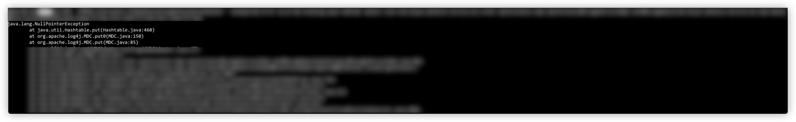

# 问题描述
测试的时候, 发现代码某处抛出了NPE:
根据堆栈信息发现在如下地方抛出.

追踪实现, 知道MDC.put底层本质上是使用的java.util.Hashtable.put

# 比较
## 几种HashMap比较
基于当前jdk1.8的实现, 比较如下:

| 操作\实现 | java.util.HashMap | java.util.concurrent.ConcurrentHashMap | java.util.Hashtable |
| --- | --- | --- | --- |
| put(null, value) | OK
可以通过get(null)获取到value | NPE | NPE |
| put(key, null) | OK
可以通过get(key)获取到null | NPE | NPE |
| get(null) | OK | NPE | NPE |
| remove(null) | OK | NPE | NPE |

## MDC&NDC比较
- MDC底层: put/get/remove 直接调用的hashtable的方法, 不论是
    - org.apache.log4j.MDC
    - 还是 org.slf4j.MDC, 底层用的还是org.apache.log4j.MDC
- NDC底层: push/pop/peek 的时候, 使用了 DiagnosticContext 封装 + java.util.Stack , 所以要安全很多

| 操作\实现 | MDC | NDC |
| --- | --- | --- |
| MDC.put(null, value) | NPE |  |
| MDC.put(key, null) | NPE |  |
| MDC.get(null) | IllegalArgumentException |  |
| MDC.remove(null) | IllegalArgumentException |  |
| NDC.push(null) |  | OK |
| NDC.pop() |  | 可以pop出null |
| NDC.peek() |  | 可以peek出null |

# 总结
- 必须要吐槽下apache的MDC实现, 理论上
    - MDC里做个NPE防御, 其实完全没有问题, 符合业务预期.
    - 底层使用ConcurrentHashMap, 以提高性能.
- 算是踩坑了, 以后使用MDC/ConcurrentHashMap/Hashtable的时候千万注意NPE!
- 尽量能用NDC就用NDC吧