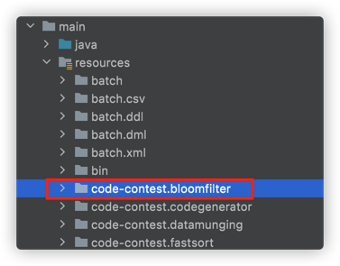

# Java SPI机制未生效, ServiceLoader获取不到实现类
---
最终定位到原因, 是因为接口实现的文件需要放在 `main/resources/META-INF/services/MyInterface` 中
而实际文件放到了: `main/resources/META-INF.services/MyInterface` 中了.

这里比较坑的一点是, 在IntelliJ IDEA中, 会默认flatten package, 即将目录路径层级用`.`连接, 因此
`main/resources/META-INF/services/MyInterface` 与 `main/resources/META-INF.services/MyInterface`
两个目录看起来是一样的, 如下(根本分不清楚到底是文件夹名字叫`codecontest.bloomfilter`还是文件夹是`codecontest/bloomfilter`): 


随便搜了下, 发现大家踩同样坑的也不少, 目前看貌似没有好的办法避免, 记住有这个坑, 后续引以为戒吧!
- [intellij idea包路径和文件夹目录的坑](https://blog.csdn.net/tszxlzc/article/details/65938891)

# Java SPI机制创建的实例无法被SpringContext管理问题
---
## 问题代码样例:
```java
/**
 * 加载实现
 */
public class MyServiceLoader {
    public static void main(String[] args) {
        ServiceLoader<MyInterface> interfaces = ServiceLoader.load(MyInterface.class);
        for (MyInterface anInterface : interfaces) {
            anInterface.sayHello();
        }
    }
}

```

```java
/**
 * 实现类
 */
@Component
public class MyImpl implements MyInterface {
    @Autowired
    MyService myService;

    @Override
    public void sayHello() {
        myService.doSomething();
    }
}
```

## 原因分析
发现在`MyImpl#sayHello`会抛出NPE, 即`myService`对象为null.
很显而易见, 因为 `MyImpl` 实例是从ServiceLoader中new出来的, 而不是由Spring容器创建的, 因此自身就脱离了SpringContext的管理.
因此`@Component`这个annotation本质是不生效的, `myService` 也不会被Spring自动注入进去. 

## 解决方案
### 方案1: 手动注入 
手动获取Context, 手动注入: 
```java
/**
 * 实现类
 */
public class MyImpl implements MyInterface {
    // SpringBeanTool代码参见 https://www.jianshu.com/p/7fc4358b4e36
    MyService myService = SpringBeanTool.getBean(MyService.class);

    @Override
    public void sayHello() {
        myService.doSomething();
    }
}
```
### 方案1的问题思考:
但一个疑问是如果MyImpl类中`myService`属性的初始化早于SpringContext的初始化 
那么 `SpringBeanTool.getBean(MyService.class);` 必然返回的是null(因为SpringContext尚未初始化完成).
实际运行测试, 发现不会返回null. 那么实际的先后顺序是怎样的? 是否有可能返回null?

### 方案2: 使用SpringBoot的SPI?? 
```java
// TODO: 这个先留个坑, 待后续研究. 
``` 

## Refs
- [Spring Boot 获取上下文环境](https://www.jianshu.com/p/7fc4358b4e36)
- [springboot-starter中的SPI 机制](https://juejin.cn/post/6844903890173837326)

# 底层cache从Tair切换到Redis遇到的坑
---
## 环境
```xml
<dependency>
    <groupId>com.fasterxml.jackson.core</groupId>
    <artifactId>jackson-core</artifactId>
    <version>2.12.5</version>
</dependency>
<dependency>
    <groupId>com.fasterxml.jackson.core</groupId>
    <artifactId>jackson-databind</artifactId>
    <version>2.12.5</version>
</dependency>
```
## Jackson序列化方式, 针对匿名内部类, 可以序列化成功, 但是反序列化失败 
本质上是由于 `@Cachable` 默认使用了Jackson序列化方式, 会默认把类型信息放到json里, 而cache中的对象是匿名内部类, 从而反序列化失败.
> 内部类实例需要其外部类实例对象来进行实例化，而Jackson在反序列化时无法创建其外部类实例对象


## Jackson序列化方式, 针对java.lang.Long类型, 可以序列化成功, 但是反序列化出来就变成了Integer类型, 从而引发CCE
- 代码样例如下, SpringCache框架默认使用了无类型的反序列化形式.

```java
public class JacksonSerializeTest {
    @Test
    public void name() {
        GenericJackson2JsonRedisSerializer serializer = new GenericJackson2JsonRedisSerializer();
        // 原始是Long类型
        Long str = 123L;
        byte[] serialize = serializer.serialize(str);
        Object deserialize = serializer.deserialize(serialize);
        // Jackson反序列化之后, 丢失了类型信息, 被默认为了Integer类型
        assertTrue(deserialize instanceof java.lang.Integer);
        assertFalse(deserialize instanceof java.lang.Long);

        Long deserialize1 = serializer.deserialize(serialize, Long.class);
        // Jackson反序列化时指定了类型信息, 则会按照类型来
        assertTrue(deserialize1 instanceof java.lang.Long);
    }
}
```

## 扩展思考
如果使用FastJson进行序列化/反序列, JSON里边同样不包含类型信息, 针对匿名内部类, 针对Long类型, 怎么防止上述问题?
### FastJson AnonymousInnerClass
```java
public class JacksonSerializeTest2 {
    @Test
    public void jacksonTest() {
        GenericJackson2JsonRedisSerializer serializer = new GenericJackson2JsonRedisSerializer();
        // 原始是AnonymousInnerClass
        MyClass c = new MyClass() {
            @Override
            public String getName() {
                return "Hello";
            }
        };
        byte[] serialize = serializer.serialize(c);
        // 序列化的JSON里, 包含了类的信息
        assertEquals("{\"@class\":\"edu.xmu.test.javax.jackson.JacksonSerializeTest2$1\",\"name\":\"Hello\"}",
            new String(serialize));
        // 下边反序列代码抛出异常, Cannot deserialize Class edu.xmu.test.javax.jackson.JacksonSerializeTest2$1 (of type
        // local/anonymous) as a Bean
        serializer.deserialize(serialize);
    }

    public static class MyClass {
        private String name;

        public void setName(String name) {
            this.name = name;
        }

        public String getName() {
            return name;
        }
    }

    @Test
    public void fastjsonTest() {
        // 原始是AnonymousInnerClass
        MyClass c = new MyClass() {
            @Override
            public String getName() {
                return "Hello";
            }
        };
        //String s = JSON.toJSONString(c, new SerializerFeature[] {SerializerFeature.WriteClassName});
        String s = JSON.toJSONString(c);
        System.out.println(s);
        Object parse = JSON.parse(s);
        System.out.println(parse.getClass());
        assertEquals("JSONObject", parse.getClass().getSimpleName());
        MyClass c2 = JSON.parseObject(s, MyClass.class);
        System.out.println(c2.getName());
    }

    @Test
    public void fastjsonTest2() {
        // 原始是AnonymousInnerClass
        MyClass c = new MyClass() {
            @Override
            public String getName() {
                return "Hello";
            }
        };
        String s = JSON.toJSONString(c, new SerializerFeature[] {SerializerFeature.WriteClassName});
        assertEquals("{\"@type\":\"edu.xmu.test.javax.jackson.JacksonSerializeTest2$3\",\"name\":\"Hello\"}", s);
        // 由于序列化的s里边包含了类型信息, 下边会报错, 信息如下:
        /*
         * com.alibaba.fastjson.JSONException: default constructor not found. class edu.xmu.test.javax.jackson
         * .JacksonSerializeTest2$3
         */
        Object parse = JSON.parse(s);
    }
}
```
### FastJson Long
代码样例如下, 反序列化时需要提供类型信息.
```java
@Test
public void fastJsonTest() {
    Long str = 123L;
    String s = JSON.toJSONString(str);
    Long str2 = JSON.parseObject(s, Long.class);
    // FastJson反序列化时指定了类型信息, 则会按照类型来
    assertTrue(str instanceof Long);
    assertEquals(str, str2);

    Object parse = JSON.parse(s);
    // FastJson反序列化之后, 丢失了类型信息, 被默认为了Integer类型
    assertTrue(parse instanceof java.lang.Integer);
    assertFalse(parse instanceof java.lang.Long);
}
```


## Refs
- [一次反序列化内部类导致的问题排查过程](https://juejin.cn/post/6844904170403659784) 

# k8s java client遇到的joda.time序列化问题
## 背景
两个系统间通过dubbo进行RPC调用, 都引用了k8s-java-client, dubbo接口说明如下:
```java
import io.kubernetes.client.openapi.models.V1Pod;

public interface K8sService {
    void doSomething(V1Pod podSpec); 
}
```

## 环境信息
- 使用的k8s-java-client版本如下:
```xml
<dependency>
    <groupId>io.kubernetes</groupId>
    <artifactId>client-java</artifactId>
    <version>10.0.0</version>
</dependency>
```

## 错误信息
1. 场景1, 系统调用 
```java
Caused by: java.lang.RuntimeException: Serialized class io.kubernetes.client.openapi.models.V1Pod must implement java.io.Serializable
```
2. 场景2, 在provider机器上, 登录dubbo控制台, 手动invoke, 错误信息如下: 
```java
Failed to invoke method normalizeCpuMem, cause: java.lang.RuntimeException: Failed to set pojo V1ObjectMeta property deletionTimestamp value 2022-02-28T18:00:24.000+08:00(class java.lang.String), cause: argument type mismatch
java.lang.RuntimeException: Failed to set pojo V1ObjectMeta property deletionTimestamp value 2022-02-28T18:00:24.000+08:00(class java.lang.String), cause: argument type mismatch
  at com.alibaba.dubbo.common.utils.PojoUtils.realize0(PojoUtils.java:450)
  at com.alibaba.dubbo.common.utils.PojoUtils.realize0(PojoUtils.java:445)
  at com.alibaba.dubbo.common.utils.PojoUtils.realize0(PojoUtils.java:372)
  at com.alibaba.dubbo.common.utils.PojoUtils.realize0(PojoUtils.java:445)
  at com.alibaba.dubbo.common.utils.PojoUtils.realize0(PojoUtils.java:445)
  at com.alibaba.dubbo.common.utils.PojoUtils.realize(PojoUtils.java:200)
  at com.alibaba.dubbo.common.utils.PojoUtils.realize(PojoUtils.java:79)
  at com.alibaba.dubbo.rpc.protocol.dubbo.telnet.InvokeTelnetHandler.telnet(InvokeTelnetHandler.java:95)
  at com.alibaba.dubbo.remoting.telnet.support.TelnetHandlerAdapter.telnet(TelnetHandlerAdapter.java:54)
```

## 原因分析
至此, 可以基本知道是由于序列化问题导致. 尤其是 `V1ObjectMeta` 里的 `deletionTimestamp` 字段, 是 `org.joda.time.DateTime` 类型. 
经搜索得知, 已经有人在dubbo社区提出这个问题: [使用hessian2无法反序列化jodatime](https://github.com/apache/dubbo/issues/9676)
但该bug仍然处于Open状态.

## 解决方案
当前临时的解决方案是: 
1. 第一步: 修改接口签名如下, 使用序列化后的JsonString.
```java
public interface K8sService {
    void doSomething(String podSpec); 
}
```
2. 第二步: Provider&Consumer都使用同样的`toJson(V1Pod)`逻辑.
参见开源实现: [gson-jodatime-serialisers](https://github.com/gkopff/gson-jodatime-serialisers)

