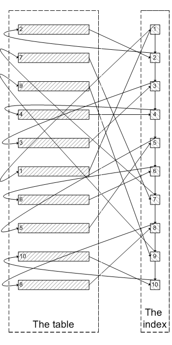

# 背景: 
在API设计时, 如果是`list`接口, 通常需要对返回的结果进行分页.

# 为啥需要分页?
1. 数据库层面: 防止由于没有limit, 导致从数据库中一次查询数据太多, 导致形成慢SQL: 
   1. 导致mysql需要把结果放在内存, 从而导致整体MySQL内存占用增加, 甚至oom
   2. 导致通过tcp数据库连接, 往client端传输耗时过久. 例如10MB的数据, 在100Mbps的带宽下需要几乎1秒
2. 应用层面: 如果没有分页, 也很容易造成应用内存占用过多, 如果是Java应用很可能触发FGC等.
3. 前端: 如果不分页, 导致浏览器无法缓存大量数据, 卡死.
所以一般对于非宽表, 以500~2000作为pageSize较为合适.

# 方案1: pageNo+pageSize 方式

## 典型常规的分页写法

- 当页数少时, 如下第1页, 耗时0ms:

```sql
mysql> select * from employees  order by emp_no desc limit 0, 3;
+--------+------------+------------+-----------+--------+------------+
| emp_no | birth_date | first_name | last_name | gender | hire_date  |
+--------+------------+------------+-----------+--------+------------+
| 499999 | 1958-05-01 | Sachin     | Tsukuda   | M      | 1997-11-30 |
| 499998 | 1956-09-05 | Patricia   | Breugel   | M      | 1993-10-13 |
| 499997 | 1961-08-03 | Berhard    | Lenart    | M      | 1986-04-21 |
+--------+------------+------------+-----------+--------+------------+
3 rows in set (0.00 sec)
```

-- 当页数多时, 如下到第300000/3=10w页, 耗时110ms: 

```sql
mysql>  select * from employees  order by emp_no desc limit 300000, 3;
+--------+------------+------------+------------+--------+------------+
| emp_no | birth_date | first_name | last_name  | gender | hire_date  |
+--------+------------+------------+------------+--------+------------+
|  10024 | 1958-09-05 | Suzette    | Pettey     | F      | 1997-05-19 |
|  10023 | 1953-09-29 | Bojan      | Montemayor | F      | 1989-12-17 |
|  10022 | 1952-07-08 | Shahaf     | Famili     | M      | 1995-08-22 |
+--------+------------+------------+------------+--------+------------+
3 rows in set (0.11 sec)
```


## 问题
如上, 随着翻页的继续, 当 `limit 1000000, 100` 的时候, 性能会急剧下降.

## 问题原因分析
具体原因参见: [MySQL 用 limit 为什么会影响性能？](https://mp.weixin.qq.com/s/Wtg9acg6M5q5kkSH4M3qXQ)
这里进行个概述, 在执行SQL时, innodb会做如下两步:  
```shell
第一步: 查询到索引叶子节点数据
第二步: 根据叶子节点上的主键值去聚簇索引上查询需要的全部字段值
```



> 像上面这样，需要查询1000000次索引节点，查询1000100次聚簇索引的数据，最后再将结果过滤掉前1000000条，取出最后100条。
> MySQL耗费了大量随机I/O在查询聚簇索引的数据上，而有1000000次随机I/O查询到的数据是不会出现在结果集当中的。
> 加载了很多热点不是很高的数据页到buffer pool，会造成buffer pool的污染，占用buffer pool的空间。

# 方案2: 改进的 pageNo+pageSize 方式

本质`方案1`是由于回表耗时, 那么可以先将主键筛选&查询出来, 然后直接根据筛选之后的主键去回表.

## 改进的分页写法
如下, 
- 从 110ms->70ms. 性能有一定提升, 但由于数据集不太好, 数据量太小. 后边试试airport数据集.
- 内层SQL本质是直接在通过主键索引将3个主键查询出来, 外层SQL根据3个主键回表查询对应行的全部信息. 

```sql
mysql> select aa.* from employees aa join (select emp_no from employees  order by emp_no desc limit 300000, 3) bb on aa.emp_no=bb.emp_no;
+--------+------------+------------+------------+--------+------------+
| emp_no | birth_date | first_name | last_name  | gender | hire_date  |
+--------+------------+------------+------------+--------+------------+
|  10024 | 1958-09-05 | Suzette    | Pettey     | F      | 1997-05-19 |
|  10023 | 1953-09-29 | Bojan      | Montemayor | F      | 1989-12-17 |
|  10022 | 1952-07-08 | Shahaf     | Famili     | M      | 1995-08-22 |
+--------+------------+------------+------------+--------+------------+
3 rows in set (0.07 sec)
```

# 方案3: nextToken+maxResults 方式

- nextToken本质上就是按照查询条件, 上一次结果集中最后一条记录的数据库主键ID值.
- 因此直接走主键索引.

## 写法

- 当第一页时, 由于没有nextToken, 因此直接获取(可以看到与pageSize写法的limit 0, 3结果是一样的): 

```sql
mysql> select * from employees order by emp_no desc limit 3;
+--------+------------+------------+-----------+--------+------------+
| emp_no | birth_date | first_name | last_name | gender | hire_date  |
+--------+------------+------------+-----------+--------+------------+
| 499999 | 1958-05-01 | Sachin     | Tsukuda   | M      | 1997-11-30 |
| 499998 | 1956-09-05 | Patricia   | Breugel   | M      | 1993-10-13 |
| 499997 | 1961-08-03 | Berhard    | Lenart    | M      | 1986-04-21 |
+--------+------------+------------+-----------+--------+------------+
3 rows in set (0.01 sec)
```

- 当第10w页时, 有了上一次的nextToken, 因此如下:

```sql
mysql> select * from employees where emp_no<10025 order by emp_no desc limit 3;
+--------+------------+------------+------------+--------+------------+
| emp_no | birth_date | first_name | last_name  | gender | hire_date  |
+--------+------------+------------+------------+--------+------------+
|  10024 | 1958-09-05 | Suzette    | Pettey     | F      | 1997-05-19 |
|  10023 | 1953-09-29 | Bojan      | Montemayor | F      | 1989-12-17 |
|  10022 | 1952-07-08 | Shahaf     | Famili     | M      | 1995-08-22 |
+--------+------------+------------+------------+--------+------------+
3 rows in set (0.00 sec)
```

## 总结
可以看到, nextToken方式, 随着页数的增加, 结果与`pageSize`方式是完全等价的, 但时间消耗完全是稳定的.

# 优缺点比较与思考
nextToken方式
- 优点: 
  - 不会随着页数的增加, 导致时间消耗线性增长. 而是直接走主键索引, 时间消耗稳定.
- 缺点: 
  - 由于nextToken只有一个值, 翻页之后, nextToken就被覆盖掉了. 只能顺序向前翻页, 而很难再退回上一页. (但实际调用端可以保存下来, )
  - nextToken值本身由于是数据库主键, 因此需要进行加密, 防止外部窥探到数据条数等敏感信息. 但加解密带了了额外的CPU消耗.

# 一些NextToken+MaxResults的实践

- AWS的[DescribeInstances](https://docs.aws.amazon.com/AWSEC2/latest/APIReference/API_DescribeInstances.html)
- AWS的[LastEvaluatedKey](https://docs.aws.amazon.com/amazondynamodb/latest/developerguide/Query.Pagination.html), 本质与NextToken是一样的
> the LastEvaluatedKey from a Query response should be used as the ExclusiveStartKey for the next Query request

- Aliyun的[DescribeInstances](https://help.aliyun.com/document_detail/25506.html)


# 其他记录
## MySQL查看BufferPool
如下, 
- PRIMARY: 代表bufferpool中数据页数.
- val: 代表bufferpool中索引页.

```sql
mysql> select TABLE_NAME, index_name,count(*) from information_schema.INNODB_BUFFER_PAGE where INDEX_NAME in('val','primary') and TABLE_NAME like '%employees%' group by TABLE_NAME, index_name;
+-------------------------+------------+----------+
| TABLE_NAME              | index_name | count(*) |
+-------------------------+------------+----------+
| `employees`.`salaries`  | PRIMARY    |     4486 |
| `employees`.`employees` | PRIMARY    |      887 |
| `employees`.`employees` | val        |       11 |
| `employees`.`dept_emp`  | PRIMARY    |      728 |
+-------------------------+------------+----------+
4 rows in set (0.05 sec)
```

## MySQL中_rowid的使用
### 限制条件
适用版本: `MySQL 5.7` ~ `MySQL 8.0.26`
参见文档: [MySQL中的_rowid](http://blog.itpub.net/26736162/viewspace-2734341/)

_rowid不存在的情况:
- `主键列`或者`非空唯一列`的类型不是`数字类型`
- 主键是联合主键
- 唯一列不是非空的

_rowid只存在于以下情况：
- 当表中存在一个 `数字类型的单列主键`时， _rowid其实就是指的是这个主键列
- 当表中 不存在主键但存在一个 `数字类型的非空唯一索引`时, _rowid其实就是指的是对应`非空唯一列`


### 测试

#### 主键列不是数字类型, 不会有_rowid

```sql
mysql> desc departments;
+-----------+-------------+------+-----+---------+-------+
| Field     | Type        | Null | Key | Default | Extra |
+-----------+-------------+------+-----+---------+-------+
| dept_no   | char(4)     | NO   | PRI | NULL    |       |
| dept_name | varchar(40) | NO   | UNI | NULL    |       |
+-----------+-------------+------+-----+---------+-------+
2 rows in set (0.00 sec)
mysql> select _rowid from departments limit 2;
ERROR 1054 (42S22): Unknown column '_rowid' in 'field list'
```

#### 联合主键, 不会有_rowid

```sql
mysql> show create table salaries;
+----------+--------------------------------------------------------------------------------------------------------------------------------------------------------------------------------------------------------------------------------------------------------------------------------------------------------------------------------------------------------+
| Table    | Create Table                                                                                                                                                                                                                                                                                                                                           |
+----------+--------------------------------------------------------------------------------------------------------------------------------------------------------------------------------------------------------------------------------------------------------------------------------------------------------------------------------------------------------+
| salaries | CREATE TABLE `salaries` (
  `emp_no` int NOT NULL,
  `salary` int NOT NULL,
  `from_date` date NOT NULL,
  `to_date` date NOT NULL,
  PRIMARY KEY (`emp_no`,`from_date`),
  CONSTRAINT `salaries_ibfk_1` FOREIGN KEY (`emp_no`) REFERENCES `employees` (`emp_no`) ON DELETE CASCADE
) ENGINE=InnoDB DEFAULT CHARSET=utf8mb4 COLLATE=utf8mb4_0900_ai_ci |
+----------+--------------------------------------------------------------------------------------------------------------------------------------------------------------------------------------------------------------------------------------------------------------------------------------------------------------------------------------------------------+
1 row in set (0.00 sec)

mysql> select _rowid from salaries limit 10;
ERROR 1054 (42S22): Unknown column '_rowid' in 'field list'
```

### 其他
感觉_rowid很鸡肋, 如果乱用很容易出错.

## MySQL公共大数据集
> 为了测试大数据集nextToken与pageNo方式, 找了很多测试大数据集, 总结如下
 
- MySQL官方的[test_db](https://github.com/datacharmer/test_db)
  - 优点: 使用起来非常简单, 按照github中的步骤, 很快就完成了数据的导入.
  - 缺点: 
    - 总体数据量不太多, 最大的`salaries`表也只有200w行左右数据, 针对翻页极端情况,
    - `salaries`表没有primary_key, 不符合第二范式, 即数据表每一个实例或者行必须被唯一标识, 导致不好验证next_token
- MySQL官方的[airportdb](https://dev.mysql.com/doc/airportdb/en/airportdb-introduction.html)
  - 优点: 数据量大, `bookings`表有5000w数据, 且符合第二范式, 可以进行nextToken验证.
  - 缺点: 
    - 导入数据需要单独安装[MySQL Shell](https://dev.mysql.com/doc/mysql-shell/8.0/en/mysql-shell-install-macos-quick.html)
    - 数据集600MB, 下载速度实在是捉急.

## MySQL Shell

### 安装
参照文档: [MySQL Shell](https://dev.mysql.com/doc/mysql-shell/8.0/en/mysql-shell-install-macos-quick.html)
mac上直接下载dmg安装就好

### 使用

- 使用 `mysqlsh` 命令进入到shell里

```shell
davywalkerdeMacBook-Pro:~ davywalker$ mysqlsh
MySQL Shell 8.0.28

Copyright (c) 2016, 2022, Oracle and/or its affiliates.
Oracle is a registered trademark of Oracle Corporation and/or its affiliates.
Other names may be trademarks of their respective owners.

Type '\help' or '\?' for help; '\quit' to exit.
 MySQL  JS > 
```

- 使用 `\connect` 命令连接数据库

否则会报 `Util.loadDump: An open session is required to perform this operation. (RuntimeError)` 错误

```shell
 MySQL  JS > \connect root@localhost:3306
Creating a session to 'root@localhost:3306'
Please provide the password for 'root@localhost:3306':
Your MySQL connection id is 31
Server version: 8.0.26 MySQL Community Server - GPL
No default schema selected; type \use <schema> to set one.
```

- enable `local_infile`

否则会报如下错误
```shell
ERROR: The 'local_infile' global system variable must be set to ON in the target server, after the server is verified to be trusted.
Util.loadDump: local_infile disabled in server (RuntimeError)
```

```shell
mysql> set global local_infile=ON;
Query OK, 0 rows affected (0.00 sec)
```

- 使用`util.loadDump`命令导入dump文件

```shell
 MySQL  localhost:3306 ssl  JS > util.loadDump("/Users/davywalker/Downloads/airport-db", {threads: 16, deferTableIndexes: "all", ignoreVersion: true})
Loading DDL and Data from '/Users/davywalker/Downloads/airport-db' using 16 threads.
Opening dump...
NOTE: Dump format has version 1.0.2 and was created by an older version of MySQL Shell. If you experience problems loading it, please recreate the dump using the current version of MySQL Shell and try again.
Target is MySQL 8.0.26. Dump was produced from MySQL 8.0.26-cloud
```
