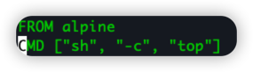

# 如何查看本机的公网IP
## 命令行
```shell
curl myip.ipip.net
curl cip.cc
curl ip.sb
```

## 页面
https://www.ipip.net/
https://ip.taobao.com/ipSearch

# sh -c 是啥意思?
在Docker中经常看到
1. 启动命令 `sh -c "ls -ltrh"` 如下:

2. Dockerfile如下: 


`-c`: string, 命令从-c后的字符串读取

