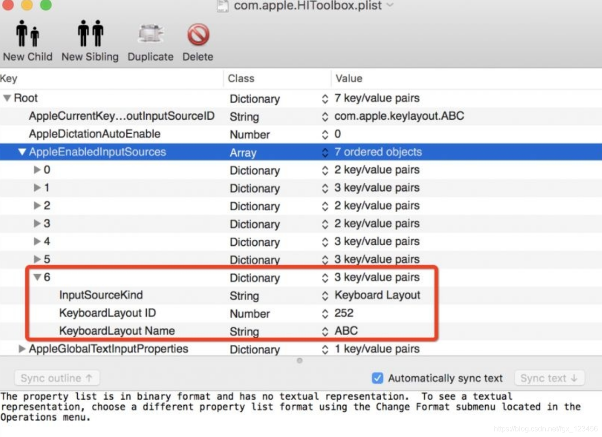
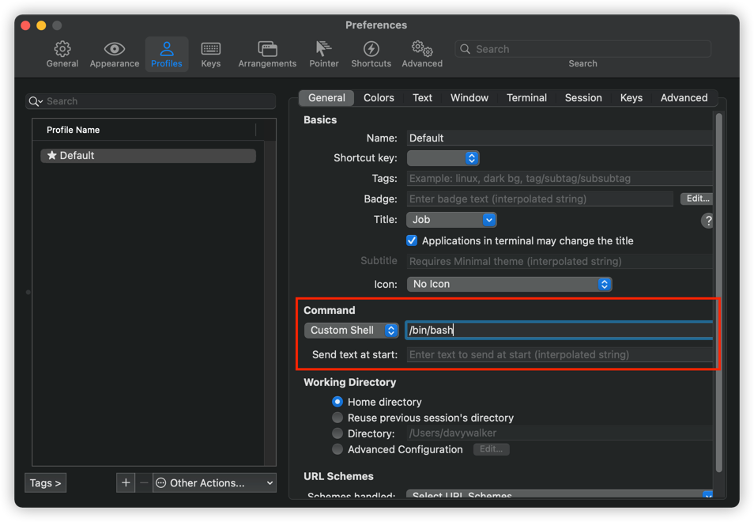

# 必装软件
* TotalFinder
* Alfred
* Git
* SourceTree
* IntelliJ IDEA
* Docker
* ClashX
* PlistEdit Pro
* HomeBrew
* XMind
* Gliffy Diagrams
* Sublime
* 空气日历
* iShot

## HomeBrew安装配置
### 安装脚本
```bash
/bin/bash -c "$(curl -fsSL https://cdn.jsdelivr.net/gh/ineo6/homebrew-install/install.sh)"
```

### 修改源站
中文安装教程（建议收藏）：https://brew.idayer.com/
如果你想换源，可以使用镜像助手：https://brew.idayer.com/guide/change-source/

# 必要配置

### 关闭SIP安全设置
1、重启 Mac，按住 Command+R 键直到 Apple logo 出现，进入 Recovery Mode

2、点击 Utilities > Terminal。（我的是中文版的，看图左上角，实用工具 > 终端）

3、在 Terminal 中输入 csrutil disable，之后回车

4、重启 Mac
（这样 SIP 安全设置就已经被关闭了，如果想重新开启该安全设置，重复上面步骤，在第三步中将命令更换为 csrutil enable。）

### 删除默认英文输入法
1. 关闭SIP
2. 使用PlistEdit Pro 编辑 `~/Library/Preferences/com.apple.HIToolbox.plist`
3. 删除 ABC的选项(或者U.S): 

4. 再次重启电脑

#### 参照
[完美删除Mac Os自带输入法](https://blog.csdn.net/fgx_123456/article/details/87815697)

### 使用bash, 替换掉默认的zsh
#### 全局账号
参考: [在 Mac 上的“终端”中更改默认 shell](https://support.apple.com/zh-cn/guide/terminal/trml113/2.11/mac/11.0)

#### iterm
`iTerm2->Preferences->Profiles->Command`



### 去除掉zsh烦人的提示
#### 提示
```bash
The default interactive shell is now zsh.
To update your account to use zsh, please run `chsh -s /bin/zsh`.
For more details, please visit https://support.apple.com/kb/HT208050.
```
#### 解决方案
```bash
> ~/.bash_profile
export BASH_SILENCE_DEPRECATION_WARNING=1
```
#### 参见 
[Suppressing "The default interactive shell is now zsh" message in macOS Catalina](https://apple.stackexchange.com/questions/371997/suppressing-the-default-interactive-shell-is-now-zsh-message-in-macos-catalina)

### 开启触摸板轻点确认
经常需要在触摸板上点击之类的, 默认是需要按下去, 才算是点击按钮, 但这样太费劲儿.

### 开启tab切换对话框选项
// todo

先写到这儿吧. 后边有啥再补充.

# 其他配置
## github
```bash
fatal: unable to access 'https://github.com/DavyJones2010/davyjones2010.github.io.git/': Failed to connect to github.com port 443: Operation timed out
```
